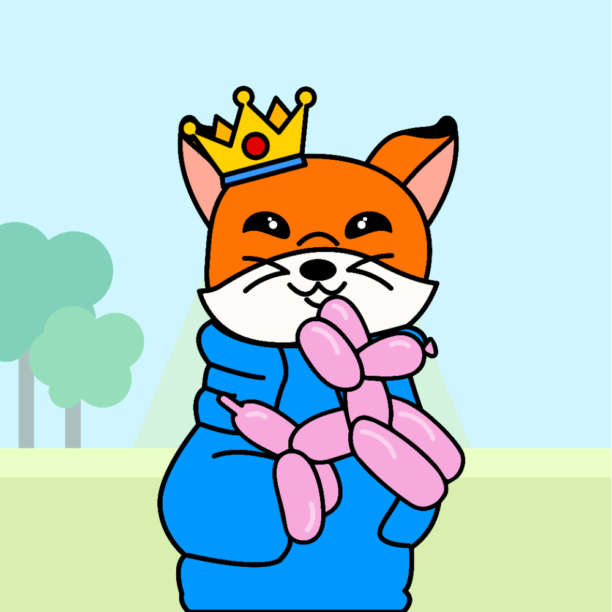
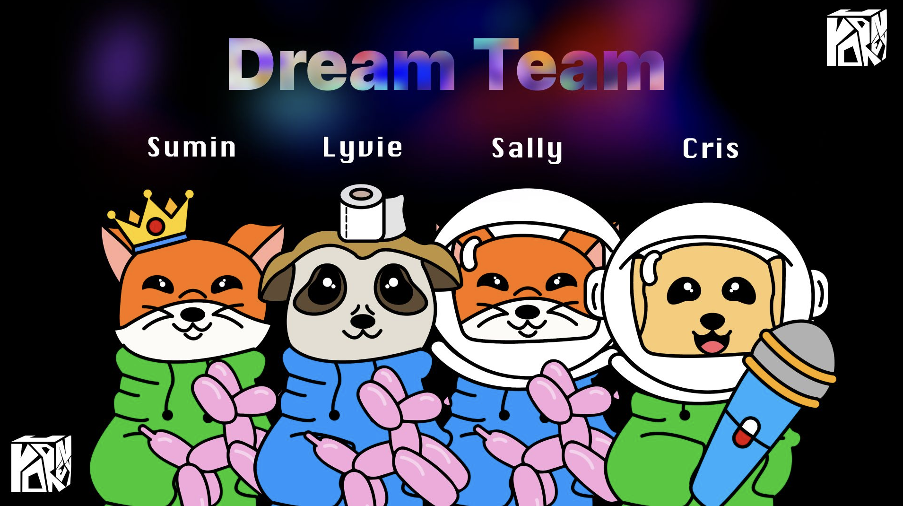

# Yourney
Life is a journey, not a destination.

Participated in [Busan Startup Weekend](https://event.techstars.com/event/yhvLHFdKlM)

## Idea 

Get your personalized character NFT based on your MBTI result!

* [Final Presentation](yourney-pitch.pdf)

## Tools

* Figma
* Node.js + Express.js, MongoDB
* [NFT-inator](https://nft-inator.com/)

## Team

- Sally (Business) 
- Lyvie (Business)
- Chris (Designer) [Linkedin](https://www.linkedin.com/in/cristopherbarrientos/) 
- Sumin (Developer) [Linkedin](www.linkedin.com/in/sumin-han-cs)

## Usage

    $ npm start

The server will execute in port 7000.
